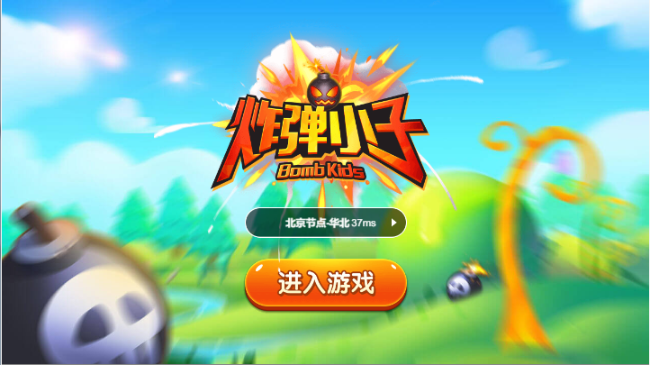
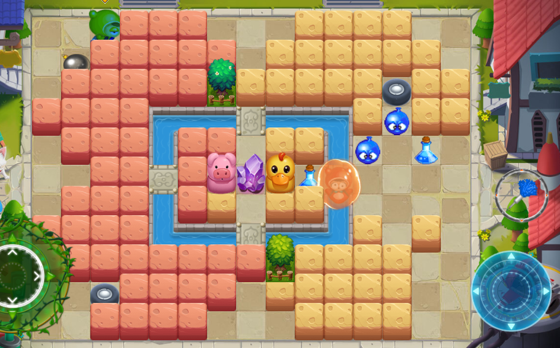

# 炸弹人

使用Matchvs+H5技术复刻经典游戏 - `炸弹人` , 展示Matchvs的联网能力和实时联网2D游戏的开发方法

游戏使用JavaScript 和 Java 开发. 客户端用了Egret H5引擎,服务端用了Matchvs Java版本的GameServer

特性:

- 瓦片贴图
- 多人同步技巧
- 多节点选择
- 组队匹配

## 在线体验

体验地址 (http://demo.matchvs.com/RombBoy/)

> 联网游戏通常为多人游戏,需要`开启多个客户端`,详情见[多开说明](http://doc.matchvs.com/MultipleIdentities)

## 源码体验

### 准备

1. 下载安装egret 5.x (https://egret.com/products/engine.html)
2. 了解Matchvs GameServer的用法,视频教程 (https://doc.matchvs.com/VideoTutorials/videogs)

### 安装

1. git clone本项目代码

####  运行在web

1. 用wing打开client目录下的工程
2. 用IDEA打开server目录下的工程
3. 点击运行按钮,即可运行游戏
4. 开始体验游戏

## 更新日志

v1.0.0 2019-03-12

1. 初始版本提交
